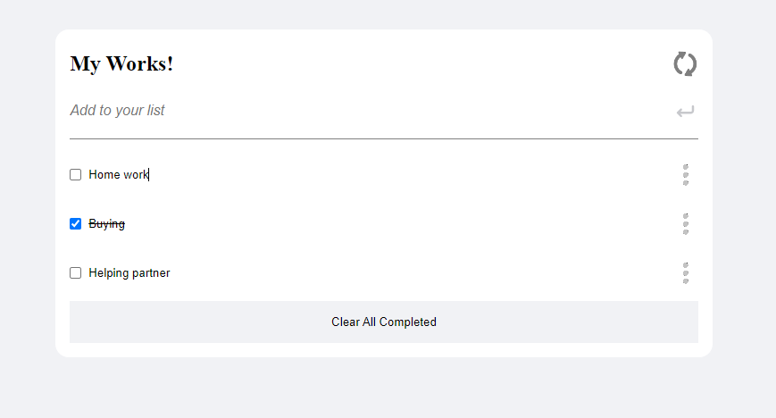

<a name="readme-top"></a>

<div align="center">

  [](https://www.microverse.org/?grsf=04r25h)
  <br/>

  <h3><b>To-Do App</b></h3>
</div>

<!-- TABLE OF CONTENTS -->

# 📗 Table of Contents

- [📖 About the Project](#about-project)
  - [🛠 Built With](#built-with)
    - [Tech Stack](#tech-stack)
    - [Key Features](#key-features)
  - [🚀 Live Demo](#live-demo)
- [💻 Getting Started](#getting-started)
  - [Setup](#setup)
  - [Prerequisites](#prerequisites)
  - [Install](#install)
  - [Usage](#usage)
  - [Run tests](#run-tests)
  - [Deployment](#deployment)
- [👥 Authors](#authors)
- [🔭 Future Features](#future-features)
- [🤝 Contributing](#contributing)
- [⭐️ Show your support](#support)
- [🙏 Acknowledgements](#acknowledgements)
- [❓ FAQ (OPTIONAL)](#faq)
- [📝 License](#license)

<!-- PROJECT DESCRIPTION -->

# 📖 [To-Do-List] <a name="about-project"></a>
>This SPA helps user to add and keep their todo works.
> Objectives of this project are to learn how to:

- Create mobile and desktop version.
- Deploy it.
- Follow GitHub flow.
- Open pull requests in GitHub.
- Write descriptive, easy to understand commit messages.
- Write short, detailed, easy to understand descriptions of pull requests.
- Write a descriptive and easy to understand README in business English for every project submitted.
- Demonstrate an ability to submit a project for code review.
- Using HTML,CSS,BOOTSTRAP and JAVASCRIPT.
- Create a enviroment for testing, use `Webpack` with `Jest`

**[To-Do-List]** is a project that has been built in this repo.

## 🛠 Built With <a name="built-with"></a>

> HTML.

> CSS.

> JavaScript.

> Git.

> GitHub.

> Webpack

> Jest.
<!-- Features -->

### Key Features <a name="key-features"></a>

> We have made use of a couple of features mainly:

- **[Linters]**
- **[HTML5]**
- **[CSS]**
- **[GitHub Pages]**
- **[Webpack]**
- **[Jest]**

<p align="right">(<a href="#readme-top">back to top</a>)</p>

<!-- LIVE DEMO -->

## 🚀 Live Demo <a name="live-demo"></a>
<!------------------------Pleas update the link -------------->

- [Live Demo Link](https://ali-0111.github.io/To-Do-List/dist/)


<p align="right">(<a href="#readme-top">back to top</a>)</p>

<!-- GETTING STARTED -->

## 💻 Getting Started <a name="getting-started"></a>

## Setup
- Clone this project
```
- $ git clone https://github.com/Ali-0111/To-Do-List.git
- $ cd To-Do-List
```
- Install npm packages
```
$ npm install
```
- Install dev dependencies

```
$ npm install --save-dev @babel/plugin-transform-modules-commonjs
```

```
$ npm install babel-eslint --save-dev
```

```
$ npm install jest jest-environment-jsdom webpack --save-dev
```

```
$ npm install webpack-cli webpack-dev-server --save-dev
```

```
$ npm install css-loader style-loader --save-dev
```

### Usage

- Open on live server

```
- $ npm run start
```

### Prerequisites

In order to run this project you need:

- Browser
- Visual Studio
- Install dependencies


### Run tests

To run tests, run the following command:

```
- $ npm run test
```

### Deployment

You can deploy this project using:
```
- GitHubPages(Free service for deployment)
```

<p align="right">(<a href="#readme-top">back to top</a>)</p>

<!-- AUTHORS -->

## 👥 Authors <a name="authors"></a>

👤 **Qurban Ali Safari**

- GitHub: [@safari](https://github.com/Ali-0111)
- Twitter: [@safari](https://twitter.com/qurban_safari)
- LinkedIn: [LinkedIn](https://www.linkedin.com/in/ali-safari-695214202/)

👤 **ClintonYounge**

- GitHub: [@ClintonYounge](https://github.com/ClintonYounge)
- Twitter: [@ClintonYounge](https://twitter.com/YoungeCjay)
- LinkedIn: [LinkedIn](https://www.linkedin.com/in/clinton-younge-83386a25a/)

👤 **mdg0410**

- GitHub: [@mdg0410](https://github.com/mdg0410)
- Twitter: [@mdg0410](https://twitter.com/steven_levoyer)
- LinkedIn: [LinkedIn](https://www.linkedin.com/in/richard-steven-levoyer-chavez-9b902525b/)


<!-- FUTURE FEATURES -->

## 🔭 Future Features <a name="future-features"></a>

> This are some of the features coming soon.

- [ ] **[Draggable Version]**

<p align="right">(<a href="#readme-top">back to top</a>)</p>

<!-- CONTRIBUTING -->

## 🤝 Contributing <a name="contributing"></a>

Contributions, issues, and feature requests are welcome!

Feel free to check the [issues page](https://github.com/Ali-0111/To-Do-List/issues).

<p align="right">(<a href="#readme-top">back to top</a>)</p>

<!-- SUPPORT -->

## ⭐️ Show your support <a name="support"></a>

> If you like this project join Microverse Org and learn how to build one from scratch.

<p align="right">(<a href="#readme-top">back to top</a>)</p>

<!-- ACKNOWLEDGEMENTS -->

## 🙏 Acknowledgments <a name="acknowledgements"></a>
-Thank you to Microverse Inc.
<!-- LICENSE -->

## 📝 License <a name="license"></a>
This work is licensed by <a rel="license" href="./LICENSE">MIT </a>.
<p align="right">(<a href="#readme-top">back to top</a>)</p>